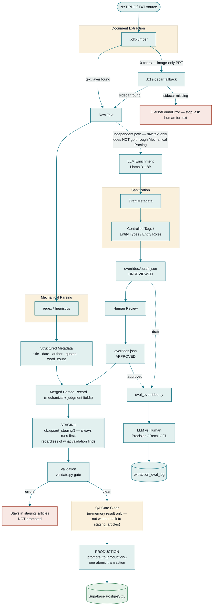

# FILTR — Article Ingestion Pipeline

A Python + Supabase (Postgres) pipeline that turns a news article PDF into a structured, queryable research record — with an optional Hugging Face LLM drafting stage whose output is measured against human judgment, not trusted on faith.

Built and validated end-to-end against a real case article: *"Hockney's Sense of Style Never Wavered,"* The New York Times, 2026-06-12.

## Design principle

Every field an article produces falls into one of two buckets, and the pipeline treats them differently:

- **Mechanical fields** — headline, date, byline, quotes, word count. Extracted by regex, directly checkable against the source text. No human or LLM involved, ever.
- **Judgment fields** — `content_type`, `tags`, `entities`. Require actually reading and interpreting the piece. These are **never guessed by code** — they only ever come from a human-approved `overrides.json`, optionally drafted first by an LLM but always reviewed before use.

`validate.py` enforces this as a hard rule: a record with every mechanical field perfect still gets blocked from promotion if a judgment field is missing.

## Pipeline flow



Two independent branches meet at one gate: the main spine answers *"should this record exist in production?"*, gated once at `validate.py`. The dotted side-branch answers a different question — *"how much can I trust the LLM's drafts?"* — and runs independently, never blocking or feeding a promotion directly.

## Project structure

```
FILTR/
├── pipeline/
│   ├── extract_pdf.py   # PDF/text extraction, with a sidecar-file fallback for image-only PDFs
│   ├── parse_article.py # Mechanical field extraction (regex) + judgment fields from overrides
│   ├── validate.py      # The QA gate — blocks promotion on missing/invalid required fields
│   ├── db.py             # Supabase Postgres access (psycopg2, parameterized, transactional)
│   ├── llm_suggest.py    # Hugging Face LLM drafting of judgment fields, sanitized before use
│   └── eval_llm.py       # Precision/Recall/F1 of an LLM draft against a human-approved file
├── run_ingest.py          # CLI: extract → parse → stage → validate → promote
├── suggest_overrides.py   # CLI: draft overrides.json via the LLM (never auto-promoted)
├── eval_overrides.py      # CLI: score a draft against a human-approved file, log the result
├── streamlit_app.py       # Interactive demo — same pipeline code, with a live Supabase status view
├── schema.sql             # Full Postgres DDL (idempotent — safe to re-run)
├── requirements.txt
└── .env.example
```

## Database schema

| Table | Purpose |
|---|---|
| `tags` | Controlled tag vocabulary — the only source of valid tags |
| `entities` | People / organizations / works, shared across articles |
| `staging_articles` | Raw landing zone — every ingestion attempt lands here first |
| `articles` | Promoted, validated records |
| `article_entities` / `article_tags` / `article_quotes` | Role-scoped joins |
| `articles_fulltext_restricted` | Full body text, separated and `license_ok`-gated |
| `extraction_eval_log` | LLM-vs-human Precision/Recall/F1, logged per run |

## Setup

```bash
pip install -r requirements.txt
cp .env.example .env
```

Fill in `.env`:
- `SUPABASE_DB_URL` — from your Supabase project's **Database → Connection string**. Use the **Session pooler** URI (IPv4-compatible), not "Direct connection" (IPv6-only, hangs on many networks).
- `HUGGINGFACE_API_TOKEN` — a **fine-grained** token from [huggingface.co/settings/tokens](https://huggingface.co/settings/tokens) with **"Make calls to Inference Providers"** explicitly enabled (a standard Read token does not include this).

> **Never commit `.env`.** It holds a live database credential and an API token.

Apply the schema once (via Supabase's SQL Editor, or `psql "$SUPABASE_DB_URL" -f schema.sql`):

```bash
python -c "from dotenv import load_dotenv; load_dotenv(); from pipeline import db; c=db.get_conn(); cur=c.cursor(); cur.execute(open('schema.sql', encoding='utf-8').read()); c.commit()"
```

## Usage

**Ingest an article** (drop its PDF, plus a `.txt` sidecar if it's image-only, and hand-write `overrides.<name>.json`):

```bash
python run_ingest.py ARTICLE.pdf --source-id SOURCE_ID --url ARTICLE_URL --overrides overrides.ARTICLE.json --promote
```

Omit `--promote` for a dry run — it stages and validates without writing to production.

**Draft judgment fields with the LLM instead of writing them by hand:**

```bash
python suggest_overrides.py ARTICLE.txt --out overrides.ARTICLE.draft.json
```

Review the draft, edit it, save it as `overrides.ARTICLE.json` — only then point `run_ingest.py` at it.

**Score the LLM against your human-approved answer:**

```bash
python eval_overrides.py overrides.ARTICLE.draft.json overrides.ARTICLE.json --source-id SOURCE_ID --log-to-db
```

**Run the interactive demo:**

```bash
streamlit run streamlit_app.py
```

Five tabs: Extract & Structure → QA Gate & SQL → Promote → Human Review (flags unreviewed drafts, dropped sanitizer output, and possible duplicate entity names) → Database Status (research-readiness computed live from Supabase, not cached).

## Known limitations

- **Entity name canonicalization** is heuristic, not enforced — `"King Charles"` and `"King Charles III"` can exist as two separate rows unless the Human Review tab's collision warning is acted on.
- **Validation results aren't persisted** to `staging_articles.validation_errors`/`validation_warnings` — a failed ingestion attempt currently leaves no durable record of *why* it failed, only terminal output.
- **LLM tag recall plateaus around 0.33** in measured testing (3 runs, same article) — it reliably finds ~2 of 6 correct controlled-vocabulary tags regardless of prompt tuning. Entity extraction improved with prompt iteration (F1 0.56 → 0.71); tagging did not. Treat every LLM draft as a starting point, not an answer.

## Governance

Source PDFs may be paywalled subscriber content, not a licensed feed. Full body text is stored in a separate, `license_ok`-gated table, never inline with queryable metadata, and `license_ok` defaults to `false` everywhere — including inside the LLM sanitizer, which overwrites any value the model returns. Every record also carries `ingestion_method` so provenance is never mistaken for a licensed crawl.
